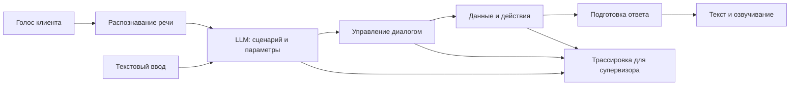

# Voice Router — Saqta

Voice Router — проект голосового помощника для контакт-центра вымышленной страховой компании Saqta. Мы разрабатываем его в рамках HackAlem AI, чтобы клиент мог описать вопрос своими словами на русском или казахском, а система выбрала подходящий сценарий обслуживания и ответила на основе данных компании.

Проблема возникает, когда робот распознаёт речь, но неверно понимает цель обращения. Например, «Когда будет выплата?» означает проверку статуса заявления, а «Выплату одобрили, но сумма слишком маленькая» — несогласие с решением. Эти запросы требуют разных действий. Смена темы, уточнения и переключение языка внутри разговора дополнительно усложняют выбор сценария.

Наше решение использует LLM для понимания реплики в контексте диалога. Модель получает каталог из 40 бизнес-сценариев с описаниями и правилами разграничения, затем возвращает выбранные сценарии, извлечённые параметры, альтернативы и объяснение. Сервер проверяет полученное решение и определяет следующий шаг: запросить сведения, получить данные, подготовить действие или передать разговор оператору.

В этой ветке `analysis` опубликовано описание проекта. Серверная реализация, на которую опирается README, находится в [версии `b1f43e7` ветки `main`](https://github.com/BAITC-Hacks/hack-63569893-ml-empire/tree/b1f43e7cd8ef98995a0599fa19dbc283376d72b4). Ссылки на код закреплены за этой версией.

Обработка голосовой реплики проходит через следующую цепочку. Контракт браузерного клиента предусматривает микрофон, воспроизведение ответа, историю разговора и отображение трассировки.



Сервер на FastAPI принимает текст и аудио через WebSocket. LangGraph связывает этапы диалога: выбор сценария, сбор параметров, обращение к данным, подтверждение и ответ. Для LLM, распознавания и синтеза речи текущая реализация использует OpenAI API. Текстовый ввод позволяет обращаться к тому же сценарию обработки без записи с микрофона.

Работа с данными выполняется через отдельные функции: найти клиента, получить полис, проверить платёж, зарегистрировать обращение и другие операции. Например, после вопроса о действии страховки приложение собирает сведения для поиска и получает запись полиса. Ответ формируется с учётом найденных фактов. Перед действием, помеченным как необратимое, сервер готовит параметры операции и запрашивает явное согласие. Подтверждение связано с идентификатором действия и его аргументами; обработчик также учитывает повторное выполнение.

Код распределён по следующим модулям:

| Модуль | За что отвечает |
| --- | --- |
| `backend/app/router.py` | Запрос к LLM и проверка структурированного решения |
| `backend/app/graph.py` | Состояние и последовательность шагов разговора |
| `backend/app/actions.py` | Операции с синтетическими данными и подтверждение действий |
| `backend/app/reply.py` | Подготовка текста ответа и обработка параметров |
| `backend/app/audio/` | Распознавание речи и потоковое озвучивание |
| `backend/app/api/` | HTTP API и обмен событиями через WebSocket |
| `backend/app/sessions.py` | Сессии разговора и результаты реплик |
| `datas/` | Каталог сценариев, факты компании, тестовые записи и разметка |

Факты о продуктах и правилах обслуживания берутся из `knowledge_base.json`. Клиенты, полисы, страховые случаи и платежи находятся в `mock_backend.json`. Все записи синтетические. Для каждой сессии создаётся отдельная копия данных; изменения и состояние разговора хранятся в памяти и сбрасываются при перезапуске сервера. Относительные даты рассчитываются от даты кейса — **1 октября 2026 года**.

Для запуска серверной версии нужны Git, Docker Engine с Compose и ключ OpenAI API. Код приложения можно получить из `main` в отдельную папку:

```powershell
git clone --branch main --single-branch https://github.com/BAITC-Hacks/hack-63569893-ml-empire.git voice-router-demo
cd voice-router-demo
Copy-Item .env.example .env
```

Укажите свой ключ в `OPENAI_API_KEY` внутри `.env`. Compose передаёт его серверу при запуске; в образ ключ не включается. Затем выполните:

```powershell
docker compose up --build -d
docker compose ps
```

Эти команды запускают сервер API на `http://localhost:8000`. Интерактивная документация доступна по адресу `http://localhost:8000/docs`. Разрешённый адрес браузерного клиента по умолчанию — `http://localhost:5173`; он настраивается через `FRONTEND_ORIGIN`. Остановить сервер можно командой `docker compose down`. Дополнительные параметры, локальный запуск через `uv` и примеры обращения к API приведены в [документации бэкенда](https://github.com/BAITC-Hacks/hack-63569893-ml-empire/blob/b1f43e7cd8ef98995a0599fa19dbc283376d72b4/backend/README.md).

Для подключения интерфейса используется [контракт HTTP и WebSocket](https://github.com/BAITC-Hacks/hack-63569893-ml-empire/blob/b1f43e7cd8ef98995a0599fa19dbc283376d72b4/frontend/docs/frontend.md). Клиент создаёт сессию, отправляет текстовую реплику либо записанное аудио и получает транскрипт, решение маршрутизатора, подготовленное действие, текст ответа, аудио и трассировку. Супервизор по этим событиям может увидеть ход обработки обращения.

Для оценки маршрутизации предоставлены 104 размеченные реплики на русском, казахском и со смешением языков, а также десять примеров диалогов. Скрипт `backend/scripts/evaluate_router.py` обращается к LLM и сохраняет выбранные сценарии; запуск требует API-ключа и расходует средства провайдера. Скрипт `datas/evaluate.py` сравнивает маршруты с разметкой. Описание формата и критериев находится в [правилах датасета](https://github.com/BAITC-Hacks/hack-63569893-ml-empire/blob/b1f43e7cd8ef98995a0599fa19dbc283376d72b4/datas/README.ru.md).

Качество пользовательского сценария определяется правильностью выбранного маршрута, языком и содержанием ответа, использованием данных нужного клиента и выполнением согласованного действия. Задержка голосового ответа измеряется от окончания речи клиента до начала воспроизведения. Контракт предусматривает событие `playback.started`, которое браузер отправляет при фактическом начале звука.
