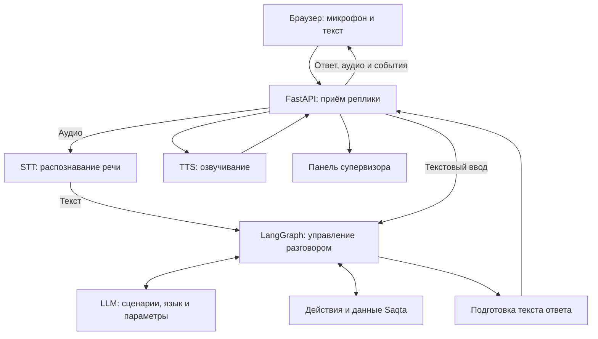

# Voice Router — голосовой помощник Saqta

> [!IMPORTANT]
> **[ОТКРЫТЬ ДЕМО VOICE ROUTER →](https://snowy-flower-9847.voronkoleha00.workers.dev/)**
>
> **Начните знакомство с проектом прямо в браузере.** Откройте демо и начните текстовый или голосовой разговор. Для голосового ввода разрешите доступ к микрофону.

Voice Router — проект команды **ML_Empire** для HackAlem AI, трек Halyk. Мы создаём голосовой веб-симулятор страхового контакт-центра: клиент описывает ситуацию на русском или казахском языке, приложение определяет подходящий сценарий, обращается к данным компании и возвращает текстовый и голосовой ответ.

Предметная область проекта — **вымышленная страховая компания Saqta**. Клиенты, полисы, выплаты и другие записи взяты из синтетического набора данных. Название Halyk в интерфейсе относится к оформлению проекта для трека хакатона. Операции приложения выполняются в демонстрационной страховой системе.

Этот README объясняет проект от пользовательской задачи до устройства кода. Для первого знакомства откройте публичное демо по ссылке выше. Ниже также описаны локальный тестовый режим и самостоятельный запуск сервера с API-ключом.

## Коротко о проекте

**Для кого и зачем.** Клиент страхового контакт-центра хочет описать ситуацию своими словами и получить подходящее обслуживание. Супервизор хочет видеть, почему робот выбрал конкретный сценарий. Voice Router объединяет разговор на русском и казахском с разбором решений системы.

**Что реализовано.** Текстовый и голосовой ввод, распознавание и озвучивание через API, выбор сценария языковой моделью, сохранение контекста внутри сессии, сбор параметров, подтверждение изменяющих операций, демонстрационная передача оператору и панель трассировки. Дополнительно доступны редактор каталога и сравнение предсказаний.

**Как работает.** Браузер отправляет реплику → STT превращает голос в текст → LLM выбирает сценарий → сервер собирает нужные сведения и вызывает обработчик → ответ из шаблонов и данных компании возвращается текстом и звуком. Ход обработки виден в панели супервизора.

**Из чего состоит.** React, TypeScript и Vite на стороне браузера; Python, FastAPI и LangGraph на сервере; JSON-каталог и синтетические страховые записи; OpenAI API для LLM, STT и TTS. Backend можно запускать через Docker Compose или uv.

**Как познакомиться.** **[Откройте демо онлайн](https://snowy-flower-9847.voronkoleha00.workers.dev/)** и попробуйте разговор. [Сценарий проверки](#walkthrough) объясняет, какие фразы отправить и что посмотреть в результате. Для запуска на своём компьютере доступны [тестовый режим без ключа](#fixture) и [полный запуск с моделями](#live).

**Границы версии.** Страховые операции выполняются над демонстрационными данными. Сессии хранятся в памяти одного процесса. Реальная телефония, CRM и долговременное хранилище разговоров не подключены. Полный перечень приведён в [ограничениях](#limitations), сведения о публикации приложения — в [разделе о развёртывании](#deployment).

## Содержание

1. [Какую проблему мы решаем](#problem)
2. [Что реализовано: наше решение и работа команды](#solution)
3. [Архитектура и обработка одной реплики](#flow)
4. [Технологии и модели](#stack)
5. [Подготовка компьютера](#setup)
6. [Первый запуск без API-ключа](#fixture)
7. [Запуск с настоящими LLM, STT и TTS](#live)
8. [Как пользоваться разговором](#conversation)
9. [Как читать панель супервизора](#supervisor)
10. [Редактор и аналитика](#labs)
11. [Данные и интеграции](#data)
12. [Состояние разговора и подтверждение действий](#state)
13. [HTTP API и WebSocket](#api)
14. [Настройки и адреса](#configuration)
15. [Проверки и оценка качества](#evaluation)
16. [Если что-то не работает](#troubleshooting)
17. [Структура репозитория и навигация по коду](#repository)
18. [Словарь терминов](#glossary)
19. [Ограничения текущей версии](#limitations)
20. [Развёрнутая версия](#deployment)

<a id="problem"></a>
## 1. Какую проблему мы решаем

Проблема данного кейса заключается в том, что голосовой робот контакт-центра может правильно распознать слова клиента, но выбрать неподходящий сценарий обслуживания. Человек задаёт вопрос о своей ситуации, а робот начинает собирать лишние сведения, отвечает на другую тему или переводит разговор оператору. Клиент тратит время на повторное объяснение, а сотрудники контакт-центра заново разбирают уже озвученный запрос.

В страховании похожие формулировки часто требуют разных действий. Вопрос «Когда будет выплата?» означает проверку статуса страхового случая. Фраза «Выплату одобрили, но сумма слишком маленькая» означает несогласие с решением. В предоставленном каталоге это разные сценарии: SC17 и SC19. Упоминания выплаты недостаточно, чтобы выбрать дальнейшее обслуживание.

Разговор зависит от предыдущих реплик. После обсуждения заявления вопрос «А какие документы ещё нужны?» относится к этому заявлению. Если человек исправляет дату, задаёт второй вопрос или переходит с русского на казахский, системе нужно сохранить смысл разговора. Потеря этих связей приводит к повторным вопросам, смешению данных и ответам по другой ситуации.

Клиенту нужен последовательный разговор, который помогает решить его вопрос. Супервизору контакт-центра нужно понимать, почему робот выбрал конкретное направление и на каком этапе произошла ошибка. Эти две потребности определяют устройство проекта: основной экран содержит разговор и информацию о его обработке.

<a id="solution"></a>
## 2. Что реализовано: наше решение и работа команды

Наше решение заключается в том, что **LLM выбирает сценарий по смыслу обращения и контексту, а сервер связывает этот выбор с данными и действиями страховой системы**. Модель получает каталог сценариев, правила разграничения похожих запросов и сведения о текущем разговоре. Её результат поступает в серверную логику в структурированном виде.

Например, клиент спрашивает, действует ли его страховка. Модель определяет сценарий проверки полиса. Сервер выясняет, достаточно ли данных для поиска, при необходимости запрашивает телефон или номер полиса, находит запись и подготавливает ответ. Сведения о сроке действия берутся из данных компании.

В проекте объединены три направления работы:

| Направление | Что сделано | Как это связано с продуктом |
| --- | --- | --- |
| Аналитика | Разобраны проблема контакт-центра, пользователи, близкие сценарии, состав данных, требования к подтверждениям и способы оценки | Определены ситуации, которые должен учитывать диалог, и факты, на которые должен опираться ответ |
| Серверная разработка | Реализованы API, LLM-маршрутизатор, граф диалога, обработчики действий, сессии, распознавание и озвучивание, Docker-сборка | Обращение проходит от текста или аудио до результата обработки |
| Клиентская разработка | Реализованы голосовой и текстовый ввод, история, подтверждения, воспроизведение, панель супервизора, редактор и аналитика | Пользователь взаимодействует с приложением, а команда видит ход обработки и может разбирать результаты |

У приложения два основных пользовательских пространства. **Разговор** предназначен для клиента: здесь он говорит, читает ответ и подтверждает действие. **Панель супервизора** показывает выбранные сценарии, причины, собранные сведения, действия и время обработки. На широком экране эти области находятся рядом; на узком между ними можно переключаться.

Отдельные разделы помогают работать с каталогом и результатами оценки. Их назначение и порядок использования описаны ниже. Настройки микрофона доступны в окне по кнопке справа от заголовка «Чат».

<a id="flow"></a>
## 3. Архитектура и обработка одной реплики

Для текстового и голосового обращения используется одна серверная логика диалога. Голос сначала преобразуется в текст. Затем приложение выбирает сценарий, получает сведения или выполняет действие, формирует ответ и передаёт его на озвучивание.



Пошагово это выглядит так:

1. **Начинается сессия.** Сервер создаёт отдельный разговор с собственным идентификатором и копией демонстрационных данных.
2. **Приходит реплика.** Браузер отправляет текст либо аудио. Для аудио клиент сообщает, когда запись закончилась.
3. **Распознаётся речь.** STT превращает звук в текст. При текстовом вводе этот шаг пропускается.
4. **Выбирается сценарий.** LLM получает реплику, недавний контекст и каталог. Она возвращает выбранные сценарии, язык, найденные параметры, объяснение и сведения о необходимости уточнения.
5. **Проверяется результат модели.** Сервер проверяет идентификаторы сценариев и допустимые поля. Затем граф диалога определяет следующий шаг.
6. **Собираются сведения.** Если для действия нужен, например, номер полиса, робот задаёт вопрос и сохраняет ответ в состоянии разговора.
7. **Вызывается обработчик.** Он получает данные, рассчитывает результат либо подготавливает изменение. Действия с обязательным подтверждением сначала показываются клиенту.
8. **Формируется ответ.** Сервер использует шаблоны сценария, результаты действий и отдельные локализованные ответы. Текст передаётся TTS и отображается в интерфейсе.
9. **Обновляется трассировка.** Супервизор получает маршрут, объяснение, действия и замеры времени для этой реплики.

**Роль LLM в текущем коде — маршрутизация и извлечение данных.** Последовательность вызова инструментов контролирует серверный граф. Конечный текст ответа подготавливается сервером из шаблонов и фактов. База знаний читается из локального JSON; `kb_lookup` получает сведения по заданному пути внутри этого файла.

У графа есть короткие переходы для отдельных ответов на уже заданный вопрос и подтверждений. Поэтому новая реплика не всегда означает новый вызов LLM. Поле `source` в трассировке показывает, был ли это выбор модели, продолжение сценария или обработка подтверждения.

В текущей версии граф собирается при запуске FastAPI, чтобы подготовка его модулей не задерживала первую клиентскую реплику. При такой подготовке не создаются разговоры и не выполняются запросы к моделям. Маршрутизатор запрашивает компактный JSON с короткими именами полей, затем проверяет и преобразует его в полный публичный формат. Описания сценариев и правила разграничения сохраняются в запросе. TTS повторно использует клиент провайдера между репликами и передаёт PCM по мере получения, сохраняя целостность 16-битных отсчётов. При остановке приложения этот клиент закрывается.

<a id="stack"></a>
## 4. Технологии и модели

| Часть | Технология | Для чего используется |
| --- | --- | --- |
| Интерфейс | React 19 и TypeScript | Экран разговора, состояния, формы, панели, редактор и аналитика |
| Запуск и сборка интерфейса | Vite 6 | Локальный сервер разработки и сборка статических файлов |
| Иконки | Lucide React | Элементы управления и обозначения состояний |
| Сервер | Python 3.11+, FastAPI, Uvicorn | HTTP API, WebSocket и обработка сессий |
| Проверка структур | Pydantic 2 | Валидация каталога и сообщений |
| Управление диалогом | LangGraph | Переходы между сбором данных, действиями, подтверждением и ответом |
| Подключение LLM | LangChain OpenAI, OpenAI Responses API, Structured Outputs | Получение решения по JSON-схеме |
| Распознавание речи | OpenAI Realtime transcription | Преобразование входящего PCM в текст |
| Озвучивание | OpenAI speech API | Потоковая выдача звука ответа |
| Связь браузера и сервера | HTTP и WebSocket | Создание сессии, передача реплик, событий и аудио |
| Данные | JSON из `datas/` и копии в памяти | Каталог, факты компании, демонстрационные записи |
| Установка Python-зависимостей | uv и `backend/uv.lock` | Воспроизводимое окружение сервера |
| Упаковка сервера | Docker Compose, Python 3.13 в образе | Запуск backend в контейнере |

Модели по умолчанию в текущей реализации:

| Задача | Значение | Как настраивается |
| --- | --- | --- |
| Выбор сценария | `gpt-6-sol` | Переменная `ROUTER_MODEL` |
| Режим рассуждения маршрутизатора | `none` | `ROUTER_REASONING_EFFORT`; также поддерживается `low` |
| Распознавание речи | `gpt-live-transcribe` | Аргумент конструктора `Transcriber` |
| Озвучивание | `gpt-4o-mini-tts` | Аргумент конструктора `Synthesizer` |
| Голос синтеза | `coral` | Аргумент конструктора `Synthesizer` |

Сервер передаёт запросы внешнему провайдеру. Для такого запуска локальная видеокарта и скачивание весов моделей не требуются. Нужны интернет, API-ключ и доступ проекта провайдера к используемым моделям. Реальные обращения к LLM, STT и TTS расходуют средства аккаунта провайдера.

<a id="setup"></a>
## 5. Подготовка компьютера

### 5.1. Что установить

| Программа | Когда нужна | Установка |
| --- | --- | --- |
| Git | Получение проекта и обновлений | [Git для Windows](https://git-scm.com/install/windows) |
| Node.js и npm | Все режимы запуска фронтенда | [Node.js, ветка 24 LTS](https://nodejs.org/en/download) |
| Современный браузер с микрофоном | Голосовой ввод и воспроизведение | Разрешение на микрофон выдаётся при первом обращении |
| Docker Desktop с Compose | Запуск backend в контейнере | [Инструкция Docker для Windows](https://docs.docker.com/desktop/setup/install/windows-install/) |
| Python 3.11+ и uv | Backend без Docker, Python-тесты и оценка маршрутизации | [Установка uv](https://docs.astral.sh/uv/getting-started/installation/) |

Для контейнерного запуска Python и uv на компьютере не нужны: Python находится внутри образа. Для локального тестового сервера фронтенда достаточно Git, Node.js и браузера.

Ниже команды приведены для **Windows PowerShell**. Используется `npm.cmd`, чтобы npm работал и при запрете PowerShell-скриптов `npm.ps1`. В macOS/Linux используйте `npm` и команды своей оболочки для копирования файлов и открытия редактора. Тесты фронтенда используют встроенную поддержку TypeScript в Node.js.

После установки откройте новое окно PowerShell и проверьте доступность нужных программ:

```powershell
git --version
node --version
npm.cmd --version
```

Для Docker-варианта дополнительно:

```powershell
docker --version
docker compose version
```

Для Python-варианта:

```powershell
uv --version
```

### 5.2. Получить проект

Откройте PowerShell в папке, где хотите хранить проект, и выполните:

```powershell
git clone --branch main https://github.com/BAITC-Hacks/hack-63569893-ml-empire.git voice-router
cd voice-router
```

Если репозиторий уже скачан, перейдите в его папку. **Все последующие команды выполняются из корня репозитория** — папки с этим README, каталогами `frontend/`, `backend/`, `datas/` и файлом `compose.yaml`.

Установите зависимости фронтенда:

```powershell
npm.cmd --prefix frontend ci
```

`ci` устанавливает версии из `frontend/package-lock.json`. При первом запуске требуется интернет для загрузки пакетов. Далее выберите тестовый режим или запуск с настоящим API.

<a id="fixture"></a>
## 6. Первый запуск без API-ключа

Этот вариант позволяет познакомиться с интерфейсом, состояниями соединения, подтверждением действий и панелью супервизора. Он запускает локальный сервер с заранее подготовленными ответами. Оплата API и Python-сервер для него не нужны.

Из корня проекта выполните:

```powershell
npm.cmd --prefix frontend run dev:fixture
```

Дождитесь сообщения об успешном запуске и откройте **http://127.0.0.1:5175**. Команда поднимает два процесса: интерфейс на порту `5175` и тестовый API на `8011`. Оставьте терминал открытым. Чтобы остановить оба процесса, нажмите `Ctrl+C` в этом терминале.

Нажмите **«Начать разговор»** и отправьте текст. Тестовый сервер вернёт подготовленный результат с карточкой подтверждения. Так можно увидеть, как приложение принимает реплику, показывает действие и ожидает решения клиента.

Обычные фразы в этом режиме не обрабатываются языковой моделью. Для отдельных состояний предусмотрены команды, которые вводятся в поле сообщения:

| Текст сообщения | Что показывает тестовый сервер |
| --- | --- |
| `/handoff` | Передачу обращения оператору |
| `/slots` | Сбор параметров для сценария |
| `/error` | Ошибку обработки |
| `/mixed` | Смешанный языковой пример |
| `/partial-metrics` | Трассировку с частично заполненными замерами |
| `/context` | Сведения о контексте и очереди задач |
| `/audio` | Короткий тестовый звуковой сигнал длительностью около 300 мс |
| `/emotion` | Пример дополнительных метаданных эмоционального состояния |
| `/disconnect` | Однократный разрыв соединения в текущей сессии |

`/audio` воспроизводит тон, а не синтезированную речь. `/emotion` передаёт искусственно подготовленные поля. Проверять качество STT, TTS, маршрутизации или определения эмоций по этим примерам нельзя. В разговоре этого режима используйте только текст: отправка аудио через микрофон вызовет ошибку тестового сервера. Для разговора с моделями используйте следующий раздел README.

<a id="live"></a>
## 7. Запуск с настоящими LLM, STT и TTS

Здесь работают браузерный интерфейс и Python-сервер. Сервер обращается к провайдеру моделей, поэтому требуется действующий `OPENAI_API_KEY`. В текущей реализации используются OpenAI-клиенты и указанные выше модели. Ключ NVIDIA API сам по себе не подключает этот сервер к NVIDIA: настройки другого провайдера в инструкции запуска не предусмотрены.

Общая последовательность: подготовить два файла настроек, запустить backend, запустить frontend и открыть страницу. Для backend выберите **один** способ: Docker или uv.

### 7.1. Настроить сервер

В корне проекта есть шаблон [.env.example](.env.example). Создайте из него `.env`, если файла ещё нет:

```powershell
if (-not (Test-Path -LiteralPath .env)) {
    Copy-Item -LiteralPath .env.example -Destination .env
}
notepad .env
```

В редакторе укажите:

```dotenv
OPENAI_API_KEY=YOUR_OPENAI_API_KEY
ROUTER_MODEL=gpt-6-sol
ROUTER_REASONING_EFFORT=none
FRONTEND_ORIGIN=http://127.0.0.1:5173
```

Замените `YOUR_OPENAI_API_KEY` своим ключом и сохраните файл. Не переносите ключ в исходники фронтенда: браузер должен обращаться к вашему серверу, а сервер — к провайдеру. Корневой `.env` включён в `.gitignore`.

### 7.2. Настроить интерфейс

Второй файл относится только к фронтенду:

```powershell
if (-not (Test-Path -LiteralPath frontend/.env.local)) {
    Copy-Item -LiteralPath frontend/.env.example -Destination frontend/.env.local
}
notepad frontend/.env.local
```

Укажите адрес backend:

```dotenv
VITE_API_BASE_URL=http://127.0.0.1:8000
```

Здесь нет API-ключа. Переменные `VITE_*` доступны клиентскому приложению, поэтому в них хранится только публичная конфигурация подключения.

**В этом руководстве везде используется `127.0.0.1`.** Открывайте страницу именно по приведённому адресу. `http://localhost:5173` и `http://127.0.0.1:5173` — разные значения Origin для браузера. Сервер проверяет Origin при подключении WebSocket.

### 7.3. Способ A: backend через Docker

Запустите Docker Desktop, дождитесь готовности Docker Engine и выполните:

```powershell
docker compose up --build -d
docker compose ps
```

Первый запуск загружает базовый образ и Python-зависимости, поэтому занимает больше времени. Compose поднимает **backend**. Интерфейс запускается отдельно на следующем шаге.

Проверьте, что сервер отвечает:

```powershell
Invoke-RestMethod -Uri http://127.0.0.1:8000/api/v1/health
```

Ожидаемое поле ответа: `status` со значением `ok`. Эта проверка подтверждает доступность процесса сервера. Доступ к моделям проверяется при настоящем обращении.

Документация HTTP API откроется по адресу **http://127.0.0.1:8000/docs**.

### 7.4. Способ B: backend без Docker

Если предпочитаете запускать Python на компьютере, используйте uv:

```powershell
uv sync --project backend --locked
uv run --project backend --env-file .env uvicorn app.main:app --app-dir backend --host 127.0.0.1 --port 8000
```

Первой командой устанавливаются зависимости из lock-файла. Вторая запускает приложение и явно читает корневой `.env`. Оставьте терминал открытым: в нём работает сервер.

Не запускайте одновременно Docker-backend и uv-backend на порту `8000`. Для интерфейса эти способы равнозначны: он подключается к одному адресу API.

### 7.5. Запустить frontend

Откройте ещё одно окно PowerShell, перейдите в корень проекта и выполните:

```powershell
npm.cmd --prefix frontend run dev -- --port 5173 --strictPort
```

Откройте **http://127.0.0.1:5173**. Опция `--strictPort` заставляет сервер остановиться, если порт занят. Это помогает избежать ситуации, когда Vite незаметно выбирает другой порт, а разрешённый Origin backend остаётся прежним.

Нажмите **«Начать разговор»**. После установления связи отправьте, например: «Где ваш офис в Алматы?». Дождитесь ответа и посмотрите выбранный сценарий в панели супервизора. Затем разрешите использование микрофона и произнесите запрос голосом. Для обращения на казахском можно использовать фразу «Алматыдағы кеңселеріңіз қайда?».

Текстовое обращение тоже может сопровождаться озвученным ответом. Получение текста проверяет обработку обращения. Если ответ также воспроизведён голосом, проверяется и TTS. При сбое озвучивания текст может прийти успешно. Для проверки STT нужна отдельная голосовая реплика.

### 7.6. Остановить или обновить приложение

Для фронтенда и uv-backend нажмите `Ctrl+C` в соответствующем терминале. Контейнер остановите командой:

```powershell
docker compose down
```

После изменения серверного кода пересоберите контейнер:

```powershell
docker compose up --build -d
```

После изменения корневого `.env` повторите `docker compose up -d`, чтобы Compose применил новую конфигурацию контейнера. Обычный перезапуск существующего контейнера не подменяет его переменные окружения. Для uv-backend остановите процесс и снова запустите команду с `--env-file`.

После изменения `frontend/.env.local` перезапустите Vite. Если используется собранный интерфейс, выполните сборку повторно.

### 7.7. Собрать интерфейс

```powershell
npm.cmd --prefix frontend run build
```

Результат появляется в `frontend/dist/`. Для локального просмотра сборки остановите сервер разработки и выполните:

```powershell
npm.cmd --prefix frontend run preview -- --port 5173 --strictPort
```

Backend должен продолжать работать. При публикации на другом домене адрес API и разрешённый Origin настраиваются под этот домен; для микрофона за пределами локального компьютера нужен защищённый контекст HTTPS.

<a id="conversation"></a>
## 8. Как пользоваться разговором

### 8.1. Начало и завершение

Кнопка **«Начать разговор»** создаёт сессию на сервере и открывает WebSocket. Когда интерфейс показывает готовность соединения, можно отправлять текст или записывать голос.

Большая кнопка с гарнитурой запускает голосовой разговор одним нажатием: создаёт сессию при необходимости, ожидает `session.ready`, затем запрашивает доступ к микрофону и начинает реплику с завершением после тишины. Ручное завершение остаётся доступным. Восстановление страницы и переподключение сами запись не запускают.

**«Завершить»** закрывает соединение, останавливает микрофон и воспроизведение. Уже показанная история остаётся на экране, поэтому можно прочитать результат и разобрать трассировку. **«Новый звонок»** очищает текущий разговор в интерфейсе. После этого новый запуск создаёт отдельную сессию.

На время записи, обработки и озвучивания часть элементов управления блокируется. Так приложение не смешивает несколько одновременных реплик одного разговора.

### 8.2. Текст и язык

Введите сообщение в поле и нажмите кнопку отправки или `Enter`. Интерфейс ограничивает сообщение 4 000 символами. После отправки реплика появляется в истории, затем приходят ответ и сведения об обработке.

Переключатель **RU / KK** меняет язык элементов интерфейса. Язык ответа сервер определяет по обращению и состоянию разговора. Переключение интерфейса не переводит уже полученную историю и не является командой серверу отвечать на другом языке.

### 8.3. Запись голосом

В режиме удержания нажмите и удерживайте кнопку микрофона, произнесите фразу и отпустите кнопку. Завершение записи отправляет команду обработки накопленного аудио. Для управления с клавиатуры предусмотрены `Space` и `Enter` на кнопке микрофона.

При первом использовании браузер спросит разрешение. Если кнопку отпустили до выдачи разрешения, подготовка записи отменяется. Разрешите микрофон и нажмите кнопку ещё раз.

Для автоматического режима нажмите шестерёнку справа от заголовка **«Чат»** и выберите **«Режим записи» → «Завершать после тишины»**. Открытие настроек не запрашивает доступ к микрофону и не запускает запись. Окно закрывается крестиком, Escape или нажатием на затемнение; выбранные значения сохраняются в пределах страницы. Нажмите кнопку микрофона один раз: запись начнётся и закончится после паузы. Можно завершить её вручную. В настройках доступны:

| Параметр | Значение по умолчанию | На что влияет |
| --- | --- | --- |
| Длительность тишины | 1 500 мс, диапазон 800–2 500 мс | Через какую паузу после речи закончится запись |
| Порог уровня сигнала | 0,025, диапазон 0,005–0,08 | Какой уровень считается речью для определения пауз |
| Устройство ввода | Доступный микрофон браузера | Откуда берётся звук |

Более низкий порог помогает при тихой речи, но сильнее реагирует на фоновые звуки. Более длинная пауза даёт время закончить мысль. Начальная тишина до обнаружения речи сама по себе не завершает запись. Названия микрофонов могут появиться только после выдачи разрешения браузеру.

### 8.4. Подтверждение действия

Если действие требует согласия, сервер присылает карточку с описанием подготовленной операции. В ней видны доступные для показа параметры; чувствительные поля отображаются с маскированием.

Прочитайте карточку и выберите подтверждение или отказ. Кнопка отправляет обычную следующую реплику на русском или казахском. Сервер связывает её с ожидающим действием. Закрытие карточки, просмотр примера или открытие другого раздела не равнозначны согласию на выполнение операции.

### 8.5. Звук ответа

Можно отключить озвучивание, остановить текущий звук или повторно прослушать сохранённый ответ. Текст остаётся доступен при выключенном звуке.

Остановка воспроизведения останавливает звук в браузере. Обработка на сервере может продолжаться, а полученные аудиофрагменты сохраняются для повторного прослушивания. Повтор использует уже полученное аудио и не создаёт новый запрос к TTS. Кнопка доступна, когда приложение не занято и звук включён.

### 8.6. Обрыв соединения и возврат в разговор

При временном разрыве приложение пробует восстановить соединение до четырёх раз с задержками 1, 2, 4 и 8 секунд. После исчерпания попыток доступно ручное восстановление. На начальное подключение отведено около 10 секунд; отсутствие событий во время обработки в течение 60 секунд также приводит к восстановлению соединения.

**Реплика не отправляется повторно автоматически.** Сервер мог успеть выполнить действие до потери связи. Сначала посмотрите состояние разговора и последний результат. Функция возврата текста в поле ввода восстанавливает черновик сообщения; следующая отправка остаётся отдельным действием пользователя.

При перезагрузке страницы интерфейс может восстановить сведения о серверной сессии, если она ещё существует. Полная история и аудиозаписи в хранилище браузера не сохраняются. После перезапуска backend прежняя сессия исчезает, и разговор нужно начать заново.

<a id="supervisor"></a>
## 9. Как читать панель супервизора

Панель супервизора объясняет, как приложение обработало конкретную реплику. Она обновляется по событиям backend и позволяет выбрать предыдущую реплику для разбора. Фильтры по языку, сценарию и статусу помогают найти нужный участок разговора.

### 9.1. Маршрут и состояние задачи

| Поле или группа | Как понимать |
| --- | --- |
| Выбранный сценарий | Основное намерение, определённое при обработке реплики |
| Активный сценарий | Задача, которую граф выполняет сейчас; она может отличаться от свежего выбора маршрутизатора |
| Дополнительные сценарии | Другие намерения, обнаруженные в той же реплике |
| Ожидающие сценарии | Задачи в очереди разговора |
| Приостановленные сценарии | Задачи, выполнение которых было прервано другим обращением |
| Альтернативы и причина | Дополнительные варианты и объяснение решения, если backend их передал |
| Источник решения | Выбор LLM, продолжение текущего сценария или обработка подтверждения |
| Параметры, или слоты | Собранные значения: продукт, город, номер полиса и другие сведения |
| Действия | Вызванные обработчики и сведения об их результате |
| Передача оператору | Очередь и причина передачи, если сценарий завершился таким образом |

Сведения о сценариях нужны для разных вопросов. «Что хотел клиент?» объясняет результат маршрутизации. «Что система делает сейчас?» объясняет активный сценарий. Например, после обнаружения нескольких намерений часть задач остаётся в очереди.

Если backend не прислал поле, интерфейс показывает отсутствие данных. В частности, `confidence` может быть `null`. Числовая оценка уверенности, если она присутствует, не является измеренной вероятностью правильного ответа. По ней нельзя выводить общую точность системы.

В ответе текущего компактного маршрутизатора поле `confidence_estimate` заполняется значением `null`: модель не генерирует числовую оценку уверенности. При этом краткая причина выбора сценария сохраняется.

Дополнительная панель эмоционального состояния отображает только метаданные, полученные от backend. Сам фронтенд не распознаёт эмоции по голосу и не меняет голос TTS на основании этих полей.

### 9.2. Время обработки

Временные показатели относятся к разным участкам обработки:

| Показатель | Что измеряет |
| --- | --- |
| Время маршрутизатора | Ожидание решения LLM |
| Серверные этапы | Распознавание, работа графа, озвучивание и другие этапы, для которых сервер передал замер |
| `latency_ms.total` | Серверное время обработки; в текущем потоке включает передачу сгенерированного аудио |
| `client_first_audio_ms` | Время от завершения ввода до начала воспроизведения ответа в браузере |
| Сессионная медиана | Средний по порядку замер среди реплик с доступным значением соответствующей метрики |

В серверной трассировке дополнительно передаются `latency_ms.tts_first_audio` — время от запуска синтеза до первой отправки PCM, `latency_ms.server_first_audio` — время от входа в обработку реплики до этой отправки, и `latency_ms.post_stt_first_audio` — время от готового проверенного текста STT до первой отправки PCM. Последний показатель исключает распознавание речи; для текстовой реплики отсчёт начинается при входе в обработку. Он отсутствует, если TTS не прислал звук. Это показатели отправки сервером, а не физического звучания динамика; интерфейс отображает доступные ему этапы и отдельный клиентский замер.

Для восприятия голосового разговора особенно полезно время до первого услышанного звука. Оно отличается от времени полного завершения TTS. Значения этапов могут пересекаться по смыслу или включать друг друга, поэтому складывать все числа на панели нельзя.

Текстовые и голосовые обращения учитываются раздельно там, где это нужно для сравнения. Рядом с агрегатами важно смотреть число измеренных реплик. Отсутствующий замер не превращается в нулевую задержку.

### 9.3. Экспорт трассировки

Для выбранной реплики можно скопировать или скачать JSON. Имя файла имеет вид `voice-router-trace-<id>.json`. Экспорт включает разрешённые поля трассировки с маскированием чувствительных значений.

Этот файл удобен для разбора конкретного решения с разработчиком: в нём можно сопоставить сценарий, причину, действия и задержки. Он не заменяет выгрузку всех разговоров и не содержит восстановленную историю, которой сервер не прислал.

<a id="labs"></a>
## 10. Редактор и аналитика

В верхней шапке приложения расположены три раздела: **«Разговор»**, **«Сценарии»**, **«Оценка и сравнение»**. Основной разговор уже описан выше. Редактор и аналитика работают с локальными JSON. Все разделы используют единый стиль заголовка и подзаголовка с переводом RU/KK.

Обязательные и опциональные пункты исходного ТЗ входят в объём. Отдельный проигрыватель датасета, аудиодиагностика и статичный пример удалены как добавленные сверх ТЗ; исходные данные и QA fixture сохранены для проверки разработки. [Матрица покрытия](frontend/docs/requirements-coverage.md) отделяет банковские требования, способы реализации и проверки всего решения.

### 10.1. «Сценарии»: просмотр и подготовка каталога

Каталог определяет, какие обращения понимает маршрутизатор и как они обрабатываются. В редакторе можно найти сценарий по идентификатору, названию или описанию, посмотреть формулировки на русском и казахском, примеры, параметры, действия и границы с соседними сценариями.

Редактирование доступно через форму и полный JSON. При применении изменений проверяются структура, уникальность идентификаторов, ссылки на действия и параметры, а также обязательность подтверждения для соответствующих операций. Базовые 40 предметных и 3 системных сценария нельзя удалить; идентификатор существующего сценария сохраняется. Дополнительные записи можно добавлять и удалять при соблюдении ссылочной целостности.

Порядок работы:

1. Найдите сценарий и откройте его.
2. Измените поля формы или JSON.
3. Примените изменения к локальному черновику либо отмените неприменённую правку.
4. Экспортируйте согласованный черновик в `scenarios.local-draft.json`.

Применённый черновик сохраняется в `localStorage` браузера; есть также явное сохранение. Импорт ограничен файлом до 2 МиБ и требует подтверждения замены текущего черновика. Сброс возвращает базовый каталог после подтверждения. Незавершённое редактирование блокирует экспорт и операции, которые могли бы потерять правку.

**Редактор не публикует изменения на backend.** Экспортированный файл нужно передать разработчику для проверки и включения в серверные данные. Работающий маршрутизатор продолжает использовать каталог, загруженный сервером.

### 10.2. «Оценка и сравнение»: качество выбора сценариев

Этот раздел получает готовые предсказания и сравнивает их с разметкой `dev_utterances.json`. Он не запускает LLM сам. Два поля сравнения «Основной режим» и «Быстрый режим» обозначают два импортированных набора результатов. Названия не переключают модель или режим обработки на сервере.

Простейший формат — JSON-объект, где ключом является идентификатор реплики, а значением массив выбранных сценариев:

```json
{
  "U001": ["SC01"],
  "U002": []
}
```

Это пример **формата**, а не результат работы проекта. Пустой массив означает, что предсказание для реплики предоставлено, но сценариев в нём нет. Отсутствие ключа означает, что предсказание не предоставлено.

Для сравнения задержек можно использовать расширенную структуру:

```json
{
  "dataset_version": "1.0",
  "predictions": {
    "U001": ["SC01"],
    "U002": []
  },
  "latency_ms": {
    "U001": 350
  },
  "latency_stage": "router"
}
```

Число `350` здесь также иллюстративное. `latency_stage` должен быть `router` или `end_to_end`. Чтобы честно сравнивать задержки, обе стороны должны передать одинаковый этап измерения. Для парного сравнения используются только общие идентификаторы с допустимыми замерами в обоих наборах.

Загрузите JSON-файл до 1 МиБ. Проверяются известные сценарии, отсутствие повторов внутри массива и допустимость задержек: конечное число от 0 до 600 000 мс. Если версия датасета указана, ожидается `1.0`. Неизвестные идентификаторы реплик учитываются как лишние и не участвуют в оценке.

Покрытие показывает, для какой части набора есть предсказания. Два ключа из примера выше дают покрытие 2 из 104. Пропущенные реплики считаются ошибками при расчёте метрик по полному набору. Парное сравнение дополнительно позволяет посмотреть качество на пересечении двух импортированных наборов.

Экспорт `voice-router-evaluation.json` содержит рассчитанный отчёт. Он не является исходным файлом предсказаний и не включает исходные тексты реплик или произвольные импортированные метаданные.

<a id="data"></a>
## 11. Данные и интеграции

Для демонстрации используется синтетический набор страховой компании Saqta, предоставленный с кейсом. Каталог определяет сценарии и допустимые действия, база знаний содержит сведения для ответов, а демонстрационные записи позволяют проверять операции с клиентами, полисами и заявлениями. Размеченные обращения и диалоги используются для оценки. Подробности набора находятся в [документации данных](datas/README.ru.md).

Backend обращается к OpenAI API для выбора сценария, распознавания речи и озвучивания ответа. Ключ хранится на сервере. Страховые операции выполняются над локальными демонстрационными записями; подключение к настоящей CRM и страховой системе не реализовано.

<a id="state"></a>
## 12. Состояние разговора и подтверждение действий

### 12.1. Граф диалога

Разговор управляется графом в [backend/app/graph.py](backend/app/graph.py). Основная последовательность узлов:

```text
ingest → route → policy → identify → collect_slots → act → respond
```

`ingest` принимает реплику и обновляет контекст. `route` выбирает или продолжает сценарий. `policy` применяет правила приоритета и переходов. `identify` ищет клиента, когда это требуется. `collect_slots` собирает обязательные параметры. `act` вызывает обработчики. `respond` готовит ответ и результат обработки.

Граф может остановиться на вопросе клиенту или ожидании подтверждения. Следующая реплика продолжает сохранённое состояние. В нём находятся активный сценарий, очереди задач, собранные параметры, полученные факты, текущий шаг действий, язык, сведения о клиенте и ожидаемое подтверждение.

Если человек упомянул несколько намерений, сервер выбирает порядок их обработки и сохраняет дополнительные задачи. Срочность влияет на этот порядок. Для прерывания и возврата к предыдущей задаче предусмотрены отдельные переходы и сохранение состояния. Фактическое поведение конкретного многошагового разговора можно проследить в панели супервизора при последовательной проверке реплик из датасета.

### 12.2. От выбора сценария до вызова инструмента

Маршрутизатор получает описания сценариев, условия разграничения `not_this_if`, примеры, допустимые имена параметров и контекст. Ответ модели проверяется по структуре. После этого граф выбирает обработчик из каталога действий.

Например, справочный вопрос может привести к `kb_lookup`. Проверка полиса требует поиска записи в mock-данных. Создание заявления сначала требует заполнения полей и подтверждения. Модель помогает понять намерение и извлечь сведения, а допустимость и последовательность операций определяет приложение.

Сервер загружает пять обязательных JSON-файлов: сценарии, параметры, действия, базу знаний и mock-backend. При загрузке проверяются модели каталога, уникальность идентификаторов и ссылки между сущностями. Ошибка в обязательных данных может остановить запуск приложения.

### 12.3. Какие действия требуют согласия

Обязательное подтверждение предусмотрено для следующих обработчиков:

| Обработчик | Что меняет в демонстрационной системе |
| --- | --- |
| `create_policy` | Создаёт полис |
| `renew_policy` | Продлевает полис |
| `update_policy` | Изменяет данные полиса |
| `cancel_policy` | Отменяет полис |
| `create_claim` | Создаёт обращение по страховому случаю |
| `create_dispute` | Создаёт оспаривание решения |
| `book_inspection` | Записывает на осмотр |
| `book_appointment` | Создаёт запись на приём |
| `update_contact` | Обновляет контактные данные |

Сначала сервер формирует предварительное описание операции: что будет сделано и с какими параметрами. Граф сохраняет ожидающее действие и приостанавливается. Подтверждение приходит новой клиентской репликой. Только после положительного ответа обработчик применяет подготовленное изменение. При отказе оно не выполняется.

Для повторного исполнения одного действия с тем же идентификатором и аргументами используется сохранённый результат в рамках текущего процесса. Это дополняет проверку уникальности `turn_id`, которая защищает от повторной передачи уже принятой реплики. Эти механизмы относятся к разным уровням: реплике клиента и операции обработчика.

### 12.4. Что означает демонстрационный backend

Полисы, платежи и заявления берутся из синтетических записей. Каждая новая сессия получает собственную копию mock-backend. Изменение контакта или создание заявления в одном разговоре не изменяет исходный JSON и данные другого разговора.

Отправка SMS, создание записей и передача оператору моделируются внутри приложения. Вызов `handoff` фиксирует результат передачи и нужную очередь; он не соединяет браузер с настоящим сотрудником контакт-центра. Поиск клиента по данным демонстрационного набора также не является проверкой личности для банковских операций.

Маскирование в интерфейсе и экспорте ограничивает показ отдельных полей. Исходный текст реплики может передаваться внешнему провайдеру моделей, а голос — сервису STT. Для демонстрации используйте синтетические сведения из набора.

### 12.5. Где хранится состояние

| Сведения | Хранилище | Что происходит после закрытия или перезапуска |
| --- | --- | --- |
| Граф, сессия и изменения mock-данных | Память одного backend-процесса, `InMemorySaver` | Исчезают после перезапуска backend |
| Идентификатор текущей сессии и метаданные подключения | `sessionStorage`, ключ `voice-router-session` | Могут использоваться для восстановления подключения после перезагрузки страницы |
| История сообщений и полученное аудио | Память страницы | Сохраняются после «Завершить», очищаются при новом разговоре или перезагрузке |
| Применённый черновик каталога | `localStorage`, ключ `voice-router.catalog-draft.v1` | Сохраняется между посещениями в том же браузере и Origin |
| Импортированные оценки | Состояние интерфейса | Сохраняются при переходе между разделами, очищаются при перезагрузке |
| Экспортированные JSON | Файлы, скачанные пользователем | Сохраняются на компьютере пользователя |

HTTP-снимок сессии содержит состояние и последнюю трассировку. Он не является архивом всей переписки или аудио. После восстановления интерфейс показывает только сведения, которые действительно удалось получить.

Текущая схема рассчитана на один процесс backend. Запуск нескольких независимых worker-процессов или реплик потребовал бы общего хранилища сессий и согласованной доставки WebSocket-соединений.

<a id="api"></a>
## 13. HTTP API и WebSocket

Этот раздел нужен разработчику, который хочет подключить другой интерфейс, изучить обмен сообщениями или воспроизвести отдельный запрос.

### 13.1. HTTP

В примерах backend работает на `http://127.0.0.1:8000`.

| Метод и путь | Назначение | Основной результат |
| --- | --- | --- |
| `GET /api/v1/health` | Проверить доступность процесса | `{"status":"ok"}` |
| `GET /api/v1/catalog/scenarios` | Получить краткий каталог | Список 40 предметных сценариев с `scenario_id`, `name`, `priority` |
| `POST /api/v1/sessions` | Создать разговор | `session_id`, `ws_path`, форматы входящего и исходящего аудио, контрольная дата |
| `GET /api/v1/sessions/{session_id}` | Получить снимок разговора | Номер последнего события `last_seq`, последний turn, активный сценарий, краткое описание ожидающего подтверждения и последняя трассировка |
| `GET /docs` | Открыть интерактивное описание HTTP | Swagger UI |
| `GET /openapi.json` | Получить HTTP-схему | OpenAPI JSON |

Создание сессии из PowerShell:

```powershell
$voiceSession = Invoke-RestMethod `
    -Method Post `
    -Uri http://127.0.0.1:8000/api/v1/sessions `
    -ContentType 'application/json' `
    -Body '{}'
$voiceSession
```

Сохраните выданный `session_id` и используйте `ws_path` из ответа. Для неизвестного идентификатора HTTP-запрос состояния вернёт `404`.

### 13.2. Соединение WebSocket

Адрес имеет вид:

```text
ws://127.0.0.1:8000/api/v1/sessions/{session_id}/stream
```

Для одной сессии разрешено одно активное соединение. Неизвестная сессия, уже открытый WebSocket этой сессии или недопустимый браузерный Origin приводят к отклонению подключения сервером до принятия WebSocket. После закрытия старого соединения клиент может восстановить соединение с существующей сессией.

Текстовые события передаются JSON-сообщениями, аудио — бинарными фреймами в том же соединении. Серверные JSON-сообщения содержат `type`, `turn_id`, `seq` и `payload`. `seq` нумерует события; бинарное аудио отдельного JSON-конверта и номера `seq` не имеет.

### 13.3. Отправить текст

Пример сообщения клиента:

```json
{
  "type": "turn.text",
  "turn_id": "turn-1",
  "payload": {
    "text": "Где ваш офис в Алматы?"
  }
}
```

`turn_id` должен быть новым для каждой реплики, непустым и не длиннее 128 символов. UUID удобен, но не обязателен. Повторное использование идентификатора отклоняется. Новая реплика во время занятой обработки может получить ошибку `busy`.

### 13.4. Отправить голос

Сначала клиент объявляет начало аудиореплики:

```json
{
  "type": "turn.start",
  "turn_id": "turn-2",
  "payload": {
    "mode": "audio"
  }
}
```

Затем отправляются бинарные фреймы: **PCM16, little-endian, один канал, 24 000 Гц**. Это сырые отсчёты звука без WAV-заголовка. Размер фрейма должен быть кратен двум байтам; максимальный размер отдельного фрейма — 1 МиБ.

По окончании записи отправляется событие с тем же `turn_id`:

```json
{
  "type": "turn.commit",
  "turn_id": "turn-2",
  "payload": {}
}
```

Сервер завершает распознавание и передаёт итоговый текст в тот же граф, который обрабатывает текстовые запросы. Формат входящего и исходящего аудио также указан в ответе создания сессии.

### 13.5. Что возвращает сервер

| Событие | Что должен сделать клиент |
| --- | --- |
| `session.ready` | Отметить готовность соединения, принять идентификатор сессии и номер последнего события |
| `transcript.partial` | Обновить промежуточную расшифровку речи |
| `transcript.final` | Показать итоговый текст клиентской реплики |
| `route.decision` | Обновить сведения о выборе сценария |
| `action.preview` | Показать подготовленное действие, ожидающее подтверждения |
| `agent.text` | Добавить текст ответа |
| `audio.start` | Подготовить приём аудио ответа |
| Бинарные фреймы | Принять PCM для воспроизведения |
| `audio.end` | Завершить поток аудио |
| `trace.updated` | Обновить трассировку и метрики |
| `turn.complete` | Завершить обработку реплики |
| `error` | Показать ошибку и применить предусмотренное восстановление |

Не каждое обращение содержит все события: текстовому вводу не нужна промежуточная STT-расшифровка, а справочному ответу не нужна карточка подтверждения. При текстовом вводе сервер также присылает `transcript.final`; его начальное поле языка может быть `null`. Состояние разговора для восстановления загружается отдельным HTTP-запросом снимка сессии.

Статус в `turn.complete` принимает значения `answered`, `clarify`, `handoff` или `error`. Ожидание подтверждения относится к уточнению и дополнительно описывается состоянием pending confirmation. Отдельной клиентской команды «выполнить подтверждённую операцию» нет: подтверждение поступает следующей текстовой репликой с новым `turn_id`.

После фактического начала звука браузер может сообщить свою задержку:

```json
{
  "type": "playback.started",
  "turn_id": "turn-2",
  "payload": {
    "latency_ms": 1250
  }
}
```

`1250` — пример значения. Это сообщение помогает отличать время на сервере от ожидания первого звука клиентом.

Ошибка TTS может сопровождаться успешно полученным текстом ответа. Ошибка STT не позволяет продолжить обработку аудиореплики как корректно распознанного текста. Клиент разбирает код ошибки и контекст текущей реплики. Подробный этап сбоя STT доступен в логах backend.

Точные структуры определены в [contracts.py](backend/app/api/contracts.py), обмен реализован в [ws.py](backend/app/api/ws.py), клиентская обработка — в [api.ts](frontend/src/api.ts) и [useVoiceSession.ts](frontend/src/useVoiceSession.ts).

<a id="configuration"></a>
## 14. Настройки и адреса

### 14.1. Переменные окружения

| Переменная | Где задаётся | Значение по умолчанию или роль |
| --- | --- | --- |
| `OPENAI_API_KEY` | Корневой `.env` для Compose или окружение процесса backend | Ключ доступа к моделям; нужен для настоящей обработки |
| `ROUTER_MODEL` | Backend | `gpt-6-sol`, имя LLM-маршрутизатора |
| `ROUTER_REASONING_EFFORT` | Backend и Compose | `none`; допустимы `none` и `low` |
| `FRONTEND_ORIGIN` | Backend | По умолчанию `http://localhost:5173`; в инструкции выше явно задан `http://127.0.0.1:5173` |
| `DATA_DIR` | Backend | Путь к каталогу JSON; в Compose установлен `/app/datas` |
| `BACKEND_PORT` | Корневой `.env`, используется Compose | Внешний порт backend, по умолчанию `8000` |
| `VITE_API_BASE_URL` | `frontend/.env.local` | Явный HTTP-адрес API; в инструкции `http://127.0.0.1:8000` |

`BACKEND_PORT` меняет привязку порта Docker к компьютеру. Для uv-процесса порт задаётся аргументом `--port`. Если внешний порт backend изменён, измените и `VITE_API_BASE_URL`, затем перезапустите frontend.

Без явного `VITE_API_BASE_URL` клиент использует относительные адреса API. Vite настроен проксировать `/api`, включая WebSocket, на `http://localhost:8000`. В инструкции выше задан прямой адрес, чтобы обе части использовали одинаковый хост и не зависели от разрешения `localhost` в IPv4 или IPv6.

Модели STT, TTS и голос задаются аргументами конструкторов в [stt.py](backend/app/audio/stt.py) и [tts.py](backend/app/audio/tts.py). Переменные `STT_MODEL`, `TTS_MODEL` и `TTS_VOICE` текущий `Settings` не читает. Таймаут маршрутизатора по умолчанию составляет 15 секунд и также задаётся в настройках Python-кода, а не отдельной переменной `.env`.

Для провайдера маршрутизации установлены одна повторная попытка и ограничение ответа 768 токенами. `ROUTER_REASONING_EFFORT=low` меняет режим текущего компактного маршрутизатора. Это не возвращает старую реализацию, использованную в исходном сравнительном замере.

### 14.2. Почему адреса должны совпадать

Origin — это сочетание протокола, имени хоста и порта страницы. Например, `http://127.0.0.1:5173` и `http://127.0.0.1:5175` отличаются портом. Сервер сравнивает Origin подключения с разрешённым значением.

Если вы изменили адрес страницы, согласованно измените `FRONTEND_ORIGIN` и перезапустите backend. Если изменили адрес API, настройте `VITE_API_BASE_URL` и перезапустите frontend. Наличие ответа `/health` при неверном Origin не означает, что голосовая сессия сможет открыть WebSocket.

### 14.3. Что находится в Docker-образе

[Dockerfile](backend/Dockerfile) использует Python 3.13 и устанавливает зависимости через uv по lock-файлу. В образ включены backend и пять обязательных JSON-файлов. Интерфейс, тестовые файлы и секреты окружения в него не копируются.

Приложение работает от непривилегированного пользователя. Compose задаёт файловую систему контейнера только для чтения и временный `/tmp`. Отдельные GPU, база данных и том постоянного хранения для текущего запуска не нужны. При пересборке серверный пакет устанавливается заново из текущих исходников.

Конфигурация контейнера находится в [compose.yaml](compose.yaml), правила контекста сборки — в [.dockerignore](.dockerignore). Полный лог backend можно посмотреть так:

```powershell
docker compose logs --tail=100 backend
```

<a id="evaluation"></a>
## 15. Проверки и оценка качества

В проекте есть разные способы проверки, и каждый отвечает на свой вопрос. Автоматические тесты проверяют правила и программные контракты. Набор отдельных реплик проверяет выбор сценариев языковой моделью. Прогон диалогов показывает последовательность обслуживания. Голосовой разговор в браузере дополнительно проверяет устройство, STT, TTS и сеть.

<a id="walkthrough"></a>
### Сценарий, который можно повторить

Откройте **[публичную демоверсию](https://snowy-flower-9847.voronkoleha00.workers.dev/)**. Для проверки на своём компьютере выполните [полный запуск](#live) и откройте `http://127.0.0.1:5173`. Фразы ниже взяты из примеров каталога. Ожидаемый маршрут описывает целевое поведение сценария; фактическое решение модели видно в трассировке.

| Шаг | Действие | Что посмотреть |
| --- | --- | --- |
| 1 | Нажмите «Начать разговор» | Устанавливается соединение, становится доступен ввод |
| 2 | Напишите «Где ваш офис в Алматы?» | В истории появляется текст ответа; в маршруте ожидается `SC33`, в параметрах — город Алматы |
| 3 | Раскройте трассировку реплики | Посмотрите причину выбора, обращение к `get_offices`, ответ и переданные замеры времени |
| 4 | Завершите разговор, выберите «Новый звонок» и начните его заново | Проверка казахского обращения получает отдельный контекст |
| 5 | Произнесите «Алматыдағы кеңселеріңіз қайда?» | Сначала проверьте расшифровку, затем ожидаемый маршрут `SC33`, текст ответа и его воспроизведение |
| 6 | В отдельном новом разговоре напишите «Соедините с оператором» | Ожидается `SC37`, результат `handoff` и очередь `operator_general`; в текущей версии это демонстрационная запись передачи |
| 7 | Выберите обработанную реплику и скачайте трассировку | Получится JSON для разбора решения и доступных метрик |

Адрес и часы работы можно сопоставить с `offices` в [knowledge_base.json](datas/knowledge_base.json). При сбое голоса отдельно проверьте микрофон и текстовую отправку: это помогает определить, на каком этапе остановилась обработка.

Если API-ключа нет, используйте [тестовый режим](#fixture): откройте `http://127.0.0.1:5175`, начните разговор и отправьте обычное текстовое сообщение. Прочитайте карточку подготовленной операции и подтвердите её либо откажитесь. Затем отправьте `/handoff` и `/audio`, чтобы увидеть состояния передачи и воспроизведения. Этот путь проверяет представление событий и управление интерфейсом на подготовленных ответах.

### 15.1. Проверки кода

Из корня репозитория:

```powershell
uv sync --project backend --locked
uv run --project backend pytest backend/tests -q
npm.cmd --prefix frontend test
npm.cmd --prefix frontend run typecheck
npm.cmd --prefix frontend run build
```

Команды backend и frontend используют разные окружения: первая группа — Python/uv, вторая — Node.js/npm. Для frontend предварительно нужен `npm.cmd --prefix frontend ci`.

| Проверка | Что покрывает |
| --- | --- |
| `pytest backend/tests -q` | Каталог, обработчики, подтверждения, маршрутизатор, граф, выбранные диалоги, HTTP, WebSocket и аудиопоток |
| `npm.cmd --prefix frontend test` | Протокол клиента, состояния сессии, аудио, каталог, оценку, супервизор, навигацию, React-отрисовку и тестовый API |
| `npm.cmd --prefix frontend run typecheck` | Согласованность типов TypeScript |
| `npm.cmd --prefix frontend run build` | Проверку TypeScript и создание сборки Vite |

В автоматических тестах используются подставные провайдеры. API-ключ для этих проверок не нужен. Успешный результат подтверждает поведение проверенных компонентов, но не является процентом точности настоящей LLM или измерением качества казахской речи. Часть проверок запускает локальные сетевые соединения, поэтому запрет loopback-соединений в окружении может мешать их выполнению.

### 15.2. Прогнать настоящую LLM на 104 репликах

После подготовки корневого `.env`:

```powershell
uv run --project backend --env-file .env python backend/scripts/evaluate_router.py --model gpt-6-sol --effort none --concurrency 1 --output router-sol-none.json
```

Скрипт обрабатывает все 104 реплики с пустым диалоговым контекстом. Первая выполняется отдельно; остальные запускаются с выбранной параллельностью. `--concurrency` принимает значения от 1 до 8, по умолчанию 1. `--effort` принимает `none` или `low`, по умолчанию `none`. Прогресс выводится каждые 10 реплик и в конце. В терминале показываются p50, p95, количество замеров свыше 500 мс и метрики эталонного оценщика.

Чтобы сравнить режимы рассуждения, запустите тот же набор с `low`. CLI использует явный аргумент `--effort`: установка `ROUTER_REASONING_EFFORT=low` в `.env` сама по себе не меняет значение этого аргумента.

```powershell
uv run --project backend --env-file .env python backend/scripts/evaluate_router.py --model gpt-6-sol --effort low --concurrency 1 --output router-sol-low.json
```

Для сравнения моделей тем же скриптом предусмотрена Luna:

```powershell
uv run --project backend --env-file .env python backend/scripts/evaluate_router.py --model gpt-6-luna --effort none --concurrency 1 --output router-luna-none.json
```

Это реальные платные обращения к API. Команда не использует микрофон и не запускает STT или TTS. Отсутствие ключа завершает скрипт с кодом `2`. По умолчанию ошибка маршрутизатора останавливает прогон с указанием реплики и кодом `1`. Флаг `--continue-on-error` позволяет завершить набор: технические ошибки записываются в `failures`, а их предсказания становятся пустыми массивами и учитываются как ошибки качества.

`--output` сохраняет расширенный JSON в указанный файл; родительская папка должна существовать. Отчёт содержит модель, effort, параллельность, `predictions`, `latency_ms`, `latency_stage="router"`, сводки и категории ошибок. Исходные тексты реплик не сохраняются. Такой файл можно импортировать в раздел **«Оценка и сравнение»**.

`summary` включает все замеры, в том числе ошибочные при `--continue-on-error`; `successful_summary` содержит только успешные. `first_request_ms` описывает первую реплику, а `warm_summary` — остальные, включая их ошибки. Сводки содержат число замеров, p50, p95, максимум и количество превышений 500 мс. Первый запрос приложения не гарантирует отсутствия кэша у провайдера. Базовый `predictions.json` для внутреннего вызова CLI-оценщика дополнительно создаётся во временной папке и удаляется после расчёта.

### 15.3. Оценить уже готовые предсказания

Если у вас есть файл `predictions.json` в базовом формате «ID → массив сценариев», выполните:

```powershell
uv run --project backend python datas/evaluate.py predictions.json datas/dev_utterances.json
```

Этот расчёт локальный, модель и API-ключ не нужны. Сам `datas/evaluate.py` использует стандартную библиотеку Python, поэтому его можно вызвать и напрямую через установленный Python:

```powershell
python datas/evaluate.py predictions.json datas/dev_utterances.json
```

Для CLI-оценщика используйте базовый объект из раздела 10.2. Если предсказания взяты из расширенного отчёта, передайте только содержимое его поля `predictions`. Полный объект с полями `predictions`, `latency_ms` и `latency_stage` предназначен для импорта в интерфейсе.

### 15.4. Как понимать метрики

| Метрика | Условие правильности | Пример смысла |
| --- | --- | --- |
| `primary_acc` | Первый предсказанный сценарий совпадает с первым ожидаемым | Правильно выбран главный запрос клиента |
| `full_match` | Множество предсказанных сценариев полностью совпадает с ожидаемым | Найдены все нужные намерения и нет лишних |
| `intent_recall` | Доля найденных ожидаемых сценариев в обращениях с несколькими намерениями | Сколько задач многосоставного обращения удалось сохранить |

Например, ожидаются `SC27` и `SC04` в таком порядке. Предсказание `SC04, SC27` даёт полное совпадение множества, но ошибку основного сценария. Предсказание только `SC27` правильно определяет основной сценарий, однако теряет вторую задачу. Поэтому одного числа недостаточно для описания маршрутизатора.

Оценщик дополнительно делит результаты по языку и типу запроса. Группа `lang=kk` показывает качество выбора сценариев на казахских входных текстах. Она не оценивает грамматику казахского ответа или произношение TTS.

Пропущенные идентификаторы считаются ошибками. Лишние идентификаторы выводятся как предупреждение и не входят в набор оценки. Список `Errors` в CLI строится по несовпадению множеств: случай с правильным набором, но неверным первым сценарием, снижает `primary_acc` и может не попасть в этот список.

### 15.5. Проверить последовательность и голос

Для многошагового поведения выберите пример из [dialogs_sample.json](datas/dialogs_sample.json) и отправляйте клиентские реплики по одной в разделе **«Разговор»**, подключённом к реальному API. Не подмешивайте эталонные маршруты и ответы в отправляемый текст. На каждом шаге сопоставляйте выбранный маршрут, вопрос робота, собранные параметры и выполненное действие. Подтверждение операции проверяйте отдельно от правильности классификации её названия.

Для голосового пути выберите устройство в настройках микрофона у заголовка **«Чат»**, затем проведите настоящий разговор на синтетических данных. Разберите отдельно расшифровку, сценарий, текст ответа и его звучание. Если текст распознан неверно, последующая ошибка маршрута может быть следствием STT; если текст верен, искать причину следует уже в маршрутизации или диалоговом состоянии.

Отчёты и сценарии клиентской проверки находятся в [frontend-verification.md](frontend/docs/frontend-verification.md). Зафиксированные разработчиками замеры серверной части приведены ниже и в исходных артефактах.

<a id="latency"></a>
### 15.6. Задержка и качество маршрутизации

В сохранённых прогонах на 104 обращениях текущий компактный маршрутизатор Sol показал меньшее время ответа и правильно выбрал полный набор намерений во всех примерах:

| Показатель | Исходный Sol, `low` | Текущий компактный Sol, `none` |
| --- | ---: | ---: |
| Медиана времени маршрутизации | 2,98 с | 2,18 с |
| p95 времени маршрутизации | 4,23 с | 3,10 с |
| Полностью правильный набор намерений | 103/104 | 104/104 |

Прогоны использовали разную параллельность — 3 и 2 запроса соответственно; нагрузка сети и провайдера не контролировалась. Это наблюдаемое улучшение в сохранённых результатах. Оно не гарантирует такой же выигрыш в каждом разговоре или такую же точность на новых обращениях. Сравнение моделей и исходные JSON приведены в [отчёте измерений](docs/benchmarks/2026-09-23-voice-latency.md).

Для ускорения первого ответа сборка графа перенесена в запуск приложения. В отдельных замерах время первого обращения вне маршрутизации и старта TTS сократилось примерно с 1,31 с до 0,034 с. TTS также повторно использует соединения и передаёт аудио по мере получения.

Полная голосовая цепочка измеряется отдельно. В сохранённой проверке с искусственно созданной речью после готового текста STT до первой отправки аудио прошло **3,13 с**. Клиент получил первый PCM-фрагмент через **8,30 с** после `turn.commit`, включая ожидание распознавания и транспорта. Это единичная проверка; микрофон и физическое начало звука в динамике в ней не измерялись. Цели 0,5 с для маршрутизатора и 1,5 с от итогового STT до первого аудио пока не подтверждены.

### 15.7. Проверка контейнерного API без ключа

Для изолированной проверки упаковки предусмотрен [smoke_container.py](backend/scripts/smoke_container.py). Он проверяет HTTP, каталог, создание и восстановление сессии, WebSocket-ответ на вопрос «Вы робот?» и отклонение повторного `turn_id`. Этот вопрос обрабатывается без LLM. Отсутствие TTS при пустом ключе допускается.

Следующие команды предназначены для **Bash**, например Git Bash в Windows. Они запускают отдельный Compose-проект на порту `18080` с пустым ключом, выполняют проверку и останавливают его. Для самого проверочного скрипта нужны Python и uv на компьютере:

```bash
OPENAI_API_KEY= BACKEND_PORT=18080 docker compose --env-file /dev/null -p voice-router-smoke up --build -d --wait --wait-timeout 60
uv run --project backend python backend/scripts/smoke_container.py --base-url http://127.0.0.1:18080
OPENAI_API_KEY= BACKEND_PORT=18080 docker compose --env-file /dev/null -p voice-router-smoke down
```

Скрипт не очищает ключ у уже запущенного сервера: пустое значение должно быть задано именно серверному процессу. Если в целевом backend есть ключ, он может вызвать TTS. Эта проверка подтверждает упаковку и протокол; качество настоящих моделей измеряется отдельно.

<a id="troubleshooting"></a>
## 16. Если что-то не работает

### 16.1. Запуск и соединение

| Симптом | Что проверить и сделать |
| --- | --- |
| PowerShell сообщает, что выполнение `npm.ps1` запрещено | Используйте `npm.cmd` в командах этого README |
| Команда выполняется не в проекте или Git пишет `not a git repository` | Перейдите в папку с `README.md`, `backend/`, `frontend/`, `datas/` |
| Docker не может подключиться к Engine | Запустите Docker Desktop и дождитесь готовности; проверьте `docker compose version` |
| Порт `5173`, `5175`, `8000` или `8011` занят | Остановите ранее запущенный вами процесс в его терминале либо согласованно измените порты; fixture требует свободных `5175` и `8011` |
| `/health` недоступен | Посмотрите `docker compose ps` и логи либо терминал uv; проверьте адрес и порт backend |
| `/health` отвечает, но разговор не начинается | Сопоставьте адрес страницы с `FRONTEND_ORIGIN`; проверьте `VITE_API_BASE_URL` и отсутствие второго подключения к той же сессии |
| Сервер отклоняет подключение WebSocket | Проверьте Origin, существование сессии и единственность соединения; после перезапуска backend создайте новую сессию |
| Настройки из `.env` не применились | Для uv используйте `--env-file .env`; для Compose повторите `up -d`; после изменения frontend-настроек перезапустите Vite |
| После перезапуска сервера исчез разговор | Сессии находятся в памяти backend; начните новый разговор |
| После обновления кода контейнер ведёт себя по-старому | Выполните `docker compose up --build -d` |
| `router_unavailable` при отправке текста | Проверьте ключ, доступ к выбранной модели, лимиты аккаунта, сеть и серверный лог |

### 16.2. Микрофон и звук

| Симптом | Что проверить и сделать |
| --- | --- |
| Браузер не разрешает микрофон | Выдайте разрешение странице; используйте локальный адрес или HTTPS |
| Разрешение выдано, но запись не началась | Если кнопку отпустили во время запроса разрешения, нажмите её заново |
| Микрофон не найден или отключился | Подключите устройство заново и обновите список в настройках микрофона у заголовка «Чат» |
| Фраза заканчивается слишком рано | Увеличьте длительность тишины или перейдите к записи с удержанием |
| Тихая речь не завершает автоматическую запись | Уменьшите порог сигнала; проверьте уровень устройства |
| Запись постоянно реагирует на фон | Увеличьте порог, проверьте шум или используйте удержание кнопки |
| Текст ответа есть, звука нет | Проверьте mute, громкость, разрешение воспроизведения браузера и наличие `tts_unavailable` |
| В fixture микрофон вызывает ошибку | Разговор с тестовым API принимает только текст; для распознавания речи нужен настоящий backend |
| Воспроизводится только короткий тон | В fixture команда `/audio` специально возвращает тестовый сигнал |
| После разрыва в поле вернулся текст | Это черновик для ручного решения о повторной отправке; сначала проверьте состояние предыдущего действия |

### 16.3. Разобрать ошибку STT по серверному логу

Клиент получает обобщённое сообщение `stt_unavailable`. Backend дополнительно пишет диагностическую строку `STT failed`. Найти её в Docker-логе можно так:

```powershell
docker compose logs --since=5m backend | Select-String -Pattern 'STT failed'
```

Строка содержит этап (`init`, `feed` или `finish`), ограниченный набор кодов ошибки, число принятых байт, оценку длительности и количество аудиофреймов. Это помогает различить отсутствие входящего звука, сетевую ошибку и проблему ответа провайдера.

| Код | Возможная причина и следующий шаг |
| --- | --- |
| `empty_audio` | До завершения реплики не пришли PCM-данные; проверьте запись и события браузера |
| `empty_transcript` | Завершение не дало итогового текста; проверьте содержимое записи и повторите короткую отчётливую фразу |
| `missing_api_key`, `invalid_api_key`, `http_401` | Проверьте ключ в окружении backend |
| `http_403` | Проверьте разрешения проекта провайдера и доступ к сервису |
| `http_429`, `rate_limit_exceeded` | Проверьте квоты и ограничения частоты запросов |
| `timeout` | Проверьте сеть и доступность провайдера |
| `connection_error`, `connection_closed`, `handshake_error` | Не удалось установить или сохранить соединение с STT |
| `input_audio_buffer_commit_empty` | Провайдер отклонил завершение пустого аудиобуфера |
| `invalid_audio` | Проверьте соответствие передаваемых данных формату PCM |
| `http_5xx`, `provider_error`, `internal_error` | Для дальнейшего разбора сопоставьте этап, объём аудио и обстоятельства вызова |

При PCM16 mono 24 кГц одна миллисекунда соответствует 48 байтам. Значения `audio_bytes` и `audio_ms` описывают принятые сервером данные клиента; они не подтверждают, что провайдер обработал каждый байт.

В эту диагностическую строку не включаются исходное аудио, расшифровка, ключ, произвольное сообщение провайдера или его идентификаторы запросов. Для поиска причины обычно достаточно кода, этапа и объёма полученного звука.

<a id="repository"></a>
## 17. Структура репозитория и навигация по коду

```text
.
├── README.md                     Общая документация проекта
├── .env.example                  Шаблон настроек backend
├── compose.yaml                  Запуск backend в Docker
├── .dockerignore                 Состав контекста Docker-сборки
├── .gitignore                    Локальные настройки и генерируемые файлы
├── backend/
│   ├── Dockerfile                Сборка контейнера
│   ├── pyproject.toml            Python-зависимости и настройки проекта
│   ├── uv.lock                   Зафиксированные версии зависимостей
│   ├── app/
│   │   ├── main.py               Создание FastAPI-приложения
│   │   ├── config.py             Настройки процесса
│   │   ├── catalog.py            Загрузка и проверка каталога
│   │   ├── domain.py             Общие модели предметной области
│   │   ├── router.py             Вызов LLM и разбор решения
│   │   ├── graph.py              Управление шагами разговора
│   │   ├── actions.py            Обработчики операций
│   │   ├── reply.py              Подготовка ответов
│   │   ├── sessions.py           Сессии, состояние и трассировка
│   │   ├── api/
│   │   │   ├── contracts.py      Форматы API-сообщений
│   │   │   ├── http.py           HTTP-эндпоинты
│   │   │   └── ws.py             Обмен репликами и аудио
│   │   └── audio/
│   │       ├── stt.py            Распознавание речи
│   │       └── tts.py            Синтез речи
│   ├── scripts/
│   │   ├── evaluate_router.py    Живая оценка LLM по dev-набору
│   │   └── smoke_container.py    Сценарий проверки контейнерного API
│   └── tests/                    Автоматические проверки backend
├── frontend/
│   ├── .env.example              Шаблон адреса API
│   ├── package.json              Команды и зависимости Node.js
│   ├── package-lock.json         Зафиксированные зависимости frontend
│   ├── vite.config.ts            Dev-сервер и API-прокси
│   ├── public/
│   │   └── pcm-recorder-worklet.js  Захват аудио в браузере
│   ├── src/
│   │   ├── App.tsx               Экран и навигация
│   │   ├── useVoiceSession.ts    Жизненный цикл разговора
│   │   ├── api.ts                HTTP и WebSocket-клиент
│   │   ├── audio.ts              Запись, формат PCM и воспроизведение
│   │   ├── types.ts              Типы сообщений и состояния
│   │   ├── client-state.ts       Правила клиентского состояния
│   │   ├── session-state.ts      Восстановление сессии
│   │   ├── supervisor-model.ts   Подготовка трассировки для экрана
│   │   ├── catalog-model.ts      Правила редактора каталога
│   │   ├── evaluation-model.ts   Импорт и расчёт метрик
│   │   ├── voice-call-start.ts   Безопасный запуск голосовой реплики
│   │   ├── conversation-page-follow.ts  Прокрутка страницы вслед за чатом
│   │   ├── affect-model.ts       Отображение дополнительных метаданных
│   │   └── components/           Панели, редактор, аналитика и настройки
│   ├── scripts/dev-fixture.mjs   Запуск интерфейса с тестовым API
│   ├── tests/                    Проверки frontend и тестовый API
│   └── docs/                     Подробная документация интерфейса
├── docs/
│   ├── voice-router-architecture.md  Архитектурный документ
│   ├── PRODUCT.md                Описание продукта
│   ├── benchmarks/               Замеры моделей и голосового потока
│   └── superpowers/plans/        История планов реализации
└── datas/                        Каталог, записи, примеры и оценщик
```

### 17.1. С чего читать реализацию

Чтобы понять весь путь запроса, начните с [useVoiceSession.ts](frontend/src/useVoiceSession.ts): здесь видно создание сессии, отправку реплик и реакцию на события. Затем откройте [ws.py](backend/app/api/ws.py), который принимает эти события на сервере. Из него переходите в [sessions.py](backend/app/sessions.py) и [graph.py](backend/app/graph.py).

Чтобы понять выбор сценария, читайте [router.py](backend/app/router.py) вместе с [scenarios.json](datas/scenarios.json). Правила модели и границы сценариев удобнее разбирать рядом: описание поведения находится частично в коде, частично в данных.

Чтобы разобраться, откуда берётся конкретный факт ответа, найдите вызываемое действие в [actions.py](backend/app/actions.py), его определение в [actions.json](datas/actions.json) и используемую запись в mock-backend или базе знаний. Сборка текста находится в [reply.py](backend/app/reply.py).

Для проблем с записью и воспроизведением читайте [audio.ts](frontend/src/audio.ts), [pcm-recorder-worklet.js](frontend/public/pcm-recorder-worklet.js), [stt.py](backend/app/audio/stt.py) и [tts.py](backend/app/audio/tts.py). Они описывают разные стороны одного аудиопотока.

### 17.2. Дополнительные руководства

| Документ | Когда читать |
| --- | --- |
| [Запуск проекта](#live) и [настройки](#configuration) | Нужны согласованные команды frontend и backend |
| [Замеры маршрутизации и голоса](docs/benchmarks/2026-09-23-voice-latency.md) | Нужны результаты разработчиков, границы измерений и ссылки на исходные артефакты |
| [Устройство frontend](frontend/docs/frontend.md) | Нужно подробнее разобрать клиентскую архитектуру |
| [Функции frontend](frontend/docs/frontend-functions.md) | Нужно найти конкретное поведение интерфейса |
| [Редактор и аналитика frontend](frontend/docs/frontend-labs.md) | Нужны детали редактора, импорта и сравнения оценок |
| [Проверки frontend](frontend/docs/frontend-verification.md) | Нужны описания проверок и результаты, зафиксированные разработчиками |
| [Покрытие требований](frontend/docs/requirements-coverage.md) | Нужно сопоставить требования с клиентскими возможностями |
| [Описание данных](datas/README.ru.md) | Нужна структура страхового набора и правила его использования |

Корневой README объединяет пользовательский путь, аналитику задачи и фактическую реализацию. Для изменения поведения ориентируйтесь на соответствующий модуль и его данные; для запуска — на согласованные адреса и команды выше.

<a id="glossary"></a>
## 18. Словарь терминов

| Термин | Объяснение |
| --- | --- |
| Frontend | Приложение, которое пользователь видит в браузере |
| Backend | Сервер, который управляет разговором, данными и обращениями к моделям |
| API | Правила, по которым программы обмениваются запросами и ответами |
| LLM | Языковая модель; в этом проекте помогает определить намерение и извлечь параметры |
| Router / маршрутизатор | Компонент, выбирающий сценарии для клиентского обращения |
| STT | Speech-to-Text: преобразование речи в текст |
| TTS | Text-to-Speech: преобразование текста в звук |
| Intent / намерение | Задача, которую человек выражает фразой: например, узнать статус выплаты |
| Сценарий | Описанный в каталоге способ обработки определённого намерения |
| Slot / слот | Отдельное поле, необходимое для сценария: город, дата, номер полиса |
| Action / действие | Серверная операция: найти запись, рассчитать результат, создать заявление |
| Session / сессия | Один разговор с собственным состоянием |
| Turn / реплика | Один цикл пользовательского ввода и его обработки |
| Граф диалога | Набор шагов и правил перехода между ними |
| Trace / трассировка | Запись того, какой путь прошла обработка и какие данные о нём передал сервер |
| Handoff | Решение передать обращение в указанную очередь операторов |
| WebSocket | Постоянное соединение для обмена событиями и аудио без отдельного HTTP-запроса на каждый фрагмент |
| PCM16 | Представление звука последовательностью 16-битных отсчётов |
| RMS | Усреднённая мера уровня звукового сигнала, используемая для определения тишины |
| Latency / задержка | Время ожидания конкретного этапа или пользовательского результата |
| Медиана | Центральное значение упорядоченного набора замеров |
| Fixture | Тестовый сервер или пример с заранее подготовленным поведением |
| Mock-backend | Демонстрационные записи и операции, заменяющие внешнюю страховую систему |
| Origin | Протокол, хост и порт страницы; сервер использует их при разрешении подключения |
| Lock-файл | Список зафиксированных версий зависимостей для воспроизводимой установки |
| Idempotency / идемпотентность | Возможность повторно получить результат одной операции без повторного применения того же изменения в рамках предусмотренного механизма |

<a id="limitations"></a>
## 19. Ограничения текущей версии

Приложение реализует веб-симулятор контакт-центра на предоставленном страховом наборе. При его использовании важно учитывать границы текущей реализации:

| Область | Текущее ограничение | Что это означает при проверке |
| --- | --- | --- |
| Страховая система | Используются синтетические записи и обработчики в памяти | Новый полис, заявление, SMS или запись на приём не появляются во внешней системе |
| Телефония и оператор | Нет подключения телефонной сети и рабочего места настоящего оператора | `handoff` показывает выбранную очередь и результат передачи в симуляторе |
| Постоянное хранение | Backend хранит сессии и изменения данных в памяти | Перезапуск сервера удаляет разговоры; несколько worker-процессов не разделяют общее состояние |
| История в браузере | Полная переписка и аудио находятся в памяти страницы | После перезагрузки доступен серверный снимок, но полная история не восстанавливается |
| Подключение моделей | Настоящие LLM, STT и TTS вызываются через внешние API | Нужны интернет, подходящий ключ, доступные модели и средства на аккаунте |
| Локальные модели | Адаптеры запуска локальных весов в рабочую цепочку не включены | Режим без API-ключа использует тестовые ответы и не является локальной AI-моделью |
| Область обслуживания | Маршрутизация и ответы опираются на фиксированный каталог Saqta | Приложение не обслуживает произвольную компанию без изменения данных и обработчиков |
| Редактор сценариев | Изменения сохраняются в браузере и экспортируются файлом | Черновик не обновляет каталог работающего backend автоматически |
| Идентификация | Клиент определяется по синтетическим записям; полноценная аутентификация и разграничение ролей не реализованы | Демонстрационный поиск записи не подтверждает личность реального клиента |
| Порядок реплик | В сессии обрабатывается одна реплика за раз; часть ввода блокируется во время ответа | Одновременный двусторонний разговор с прерыванием ответа голосом не реализован |
| Эмоциональные метаданные | Фронтенд умеет показывать полученные поля | Наличие панели само по себе не означает работающего распознавания эмоций |
| Оценка качества | Текстовый dev-набор проверяет маршрутизацию отдельных реплик; голосового корпуса в репозитории нет | Процент правильных маршрутов не описывает точность STT, качество TTS или весь многошаговый разговор |
| Временная шкала данных | Используется контрольная дата 2026-10-01 | Статусы и относительные даты относятся к состоянию демонстрационного набора |

Технические ошибки и отсутствующие поля показываются отдельно от успешного результата. Например, ответ может прийти текстом при недоступном TTS, а отсутствие оценки уверенности не заменяется придуманным числом.

<a id="deployment"></a>
## 20. Развёрнутая версия

### [Открыть публичную демоверсию Voice Router →](https://snowy-flower-9847.voronkoleha00.workers.dev/)

**Демо открывается в браузере. Для знакомства через эту ссылку не нужно клонировать репозиторий и запускать проект на своём компьютере.**

1. Откройте демоверсию по ссылке выше.
2. Начните текстовый или голосовой разговор. Для голоса разрешите браузеру использовать микрофон.
3. Спросите «Где ваш офис в Алматы?» или «Алматыдағы кеңселеріңіз қайда?».
4. Посмотрите ответ и выбранный сценарий в панели супервизора.

Для самостоятельного локального запуска используйте инструкции выше. После запуска доступны адреса:

- **http://127.0.0.1:5175** — интерфейс с тестовым API после `npm.cmd --prefix frontend run dev:fixture`;
- **http://127.0.0.1:5173** — интерфейс с настоящим backend после полного запуска;
- **http://127.0.0.1:8000/docs** — HTTP-документация работающего локального backend.

Адреса `127.0.0.1` относятся к вашей локальной копии. Ссылка на опубликованное демо выделена в начале README и этого раздела.

В [отчёте от 23 сентября 2026 года](docs/benchmarks/2026-09-23-voice-latency.md) зафиксированы пересборка локального контейнера, проверка его доступности, сверка исходников контейнера и прохождение голосового запроса через прокси frontend. Это подтверждает выполненную локальную проверку на дату отчёта.
