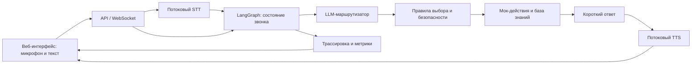

# Voice Router: архитектура решения

Статус: проектное решение для кейса Voice Router. Этот документ описывает целевую архитектуру; реализация в репозитории пока отсутствует.

## Цель и ограничения

Веб-приложение принимает речь через микрофон (текст — резервный канал), выбирает один или несколько из 40 сценариев Saqta Insurance и отвечает голосом на русском или казахском. После каждой реплики клиента супервизор видит транскрипт, выбранные сценарии, альтернативы, краткое обоснование и задержку по этапам.

Выбор бизнес-сценария делает генеративная LLM с учётом текущей реплики, состояния диалога и границ сценариев. Обученный энкодерный intent-классификатор для этого не используется. При неясном запросе агент задаёт один уточняющий вопрос; при необходимости передаёт разговор оператору вместе с контекстом. Необратимое действие выполняется только после явного подтверждения клиента.

Источники истины — файлы стартового набора: [каталог сценариев](../datas/scenarios.json), [слоты](../datas/slots.json), [действия](../datas/actions.json), [база знаний](../datas/knowledge_base.json) и [мок-бэкенд](../datas/mock_backend.json). Все даты относительно среза `2026-10-01`, заданного в [описании датасета](../datas/README.ru.md), а не системных часов сервера.

## Общая схема



Рекомендуемый стек: Python + FastAPI на сервере, LangGraph для графа состояний, React для симулятора и панели супервизора. STT, LLM и TTS подключаются через отдельные интерфейсы провайдеров, чтобы их можно было менять независимо. Секреты API хранятся только на сервере. Запуск приложения и мок-бэкенда должен выполняться одной командой.

LangGraph хранит состояние звонка и переходы между этапами; LangChain нужен лишь при желании использовать его адаптеры моделей. Здесь нет необходимости создавать агента для каждого из 40 сценариев: сценарии являются данными, а общие правила их исполнения живут в коде. Checkpointer LangGraph сохраняет состояние по `thread_id`, в том числе при ожидании ответа клиента или подтверждения действия. [Документация LangGraph о сохранении состояния](https://docs.langchain.com/oss/python/langgraph/persistence).

## Состояние звонка

Один `thread_id` соответствует одному звонку. Минимальное состояние графа:

| Поле | Назначение |
| --- | --- |
| `transcript`, `language` | Последняя реплика и преобладающий язык ответа (`ru`/`kk`); смешанную речь сохраняем в транскрипте. |
| `client_id` | Идентифицированный клиент либо `null`. |
| `active_scenario` | Сценарий, исполняемый сейчас. |
| `pending_scenarios` | Остальные намерения текущего запроса, в порядке обработки. |
| `suspended_scenarios` | Прерванные сценарии для возврата после смены темы. |
| `slots` | Проверенные значения, источник каждого значения и сценарий, которому оно принадлежит. |
| `pending_confirmation` | Имя действия, аргументы и ожидаемый явный ответ клиента либо `null`. |
| `clarification_count` | Число подряд неразрешённых уточнений. |
| `trace`, `timings` | Решение маршрутизатора, результат правил и метки времени по этапам. |

История для LLM ограничена последними релевантными репликами и кратким состоянием. Полный мок-бэкенд и вся база знаний в промпт не отправляются: после выбора сценария код передаёт только нужные записи и факты.

## Граф обработки реплики

| Узел | Действие | Переход |
| --- | --- | --- |
| `ingest` | Принимает финальный транскрипт или текст, нормализует телефон, дату и другие форматы, фиксирует конец речи. | `resume` для ответа на ожидаемый вопрос или `route` для новой задачи. |
| `route` | Один вызов LLM по компактному каталогу `SC01`–`SC40` и системным намерениям; учитывает `description`, `not_this_if`, предыдущий сценарий и реплику. | `policy`. |
| `policy` | Проверяет ID и слоты по каталогу; ставит `urgent` первым, затем сохраняет порядок упоминания; выбирает уточнение, исполнение или перевод оператору. | `clarify`, `identify`, `collect_slots`, `act` или `handoff`. |
| `identify` / `collect_slots` | Использует профиль клиента, затем спрашивает только один недостающий параметр за реплику. | Ожидание ответа либо `act`. |
| `act` | Читает факты, выполняет разрешённые безопасные действия и готовит аргументы необратимого действия без его выполнения. | `confirm` для необратимых действий, иначе `respond`. |
| `confirm` | Озвучивает действие и аргументы, ждёт явного «да»/«иә»; отказ или новая тема не запускают действие. | `execute_confirmed` или `route`. |
| `execute_confirmed` | Повторно проверяет аргументы, выполняет действие с ключом идемпотентности и очищает `pending_confirmation`. | `respond`. |
| `respond` | Формирует 1–2 коротких предложения на нужном языке, отдаёт текст в TTS и публикует трассировку. | Ожидание новой реплики. |

Для `confirm` подходит `interrupt()` LangGraph с сохранённым `thread_id`. Узел с побочным эффектом расположен **после** ожидания подтверждения: при возобновлении LangGraph начинает прерванный узел заново, поэтому действие до `interrupt()` могло бы повториться. [Документация LangGraph о прерываниях](https://docs.langchain.com/oss/python/langgraph/interrupts).

Продолжение активного сценария не требует повторной полной маршрутизации, если клиент отвечает на ожидаемый вопрос. При смене темы новый сценарий помещается в `active_scenario`, прежний — в `suspended_scenarios`; после завершения агент предлагает к нему вернуться. При нескольких намерениях срочный сценарий обрабатывается первым, остальные остаются в `pending_scenarios`.

## Контракт LLM-маршрутизатора

Для первого прототипа — `gpt-6-sol` с низким уровнем рассуждения и **Structured Outputs** через Responses API. В запрос входят реплика, компактное состояние звонка и краткое описание всех сценариев с правилами разграничения. Формат ответа проверяется схемой; ID вне каталога отклоняются. Пример логической формы результата:

```json
{
  "language": "kk",
  "is_continuation": false,
  "scenarios": [
    {"scenario_id": "SC13", "reason": "Клиент сообщает об ущербе своему автомобилю по КАСКО"},
    {"scenario_id": "SC20", "reason": "Клиент также спрашивает об осмотре"}
  ],
  "alternatives": ["SC11"],
  "slots": {"policy_number": null},
  "needs_clarification": false
}
```

`reason` — короткое объяснение для супервизора с опорой на слова клиента и правила `not_this_if`, а не скрытое рассуждение модели. Число `confidence`, требуемое панелью трассировки, нельзя трактовать как доказанную вероятность правильного ответа, если оно просто сгенерировано LLM. Его следует показывать как оценку модели и использовать для автоматических порогов только после проверки на отдельных примерах. Ошибочный формат ответа, неизвестный ID или сомнительная маршрутизация ведут к уточнению либо оператору.

По [OpenAI Docs](https://developers.openai.com/api/docs/models/gpt-6-sol) `gpt-6-sol` поддерживает Structured Outputs. `gpt-6-luna` — кандидат на более дешёвый маршрут, но переводить на него основной выбор стоит только после сравнения точности и задержки на русских, казахских и смешанных запросах; опубликованной оценки моделей именно на этом датасете нет. [Документация Structured Outputs](https://developers.openai.com/api/docs/guides/structured-outputs).

## Голос и ответ

Стартовые провайдеры для прототипа: `gpt-live-transcribe` для потокового STT и `gpt-4o-mini-tts` для TTS. Браузер передаёт аудио, а сервер получает финальный транскрипт и запускает граф. В первой версии конец реплики задаёт клиент через push-to-talk: у `gpt-live-transcribe` в транскрипционной сессии нет `server_vad`. Казахское распознавание и произношение, особенно внутри смешанной фразы, проверяются вручную до демонстрации. [OpenAI Docs: потоковая транскрипция](https://developers.openai.com/api/docs/guides/realtime-transcription), [синтез речи](https://developers.openai.com/api/docs/guides/text-to-speech).

Для простого информационного сценария ответ можно собрать из проверенного шаблона и фактов. Для сложного ответа допускается короткий дополнительный LLM-вызов, ограниченный выбранным сценарием, его слотами и результатом действия. Факты о ценах, покрытии, офисах и правилах берутся только из файлов набора.

## Трассировка, ошибки и измерение

После каждой реплики клиентский интерфейс показывает транскрипт, язык, основной и дополнительные сценарии, альтернативы, обоснование, найденные слоты, запрошенные/выполненные действия и задержку `stt`, `triage`, `router`, `response`, `tts_first_audio`, `total`. `total` измеряется от конца речи клиента до начала воспроизведения первого аудиофрагмента, а не только временем LLM-вызова.

Ошибки действий обрабатываются по `error_codes` и `error_handling` из `actions.json`: например, неизвестный телефон запрашивается повторно один раз, затем предлагается другой идентификатор или оператор. Таймаут модели, STT или TTS не должен приводить к выполнению действия; клиенту показывается понятное сообщение и доступен текстовый канал. При переводе оператору передаются активный сценарий, собранные слоты и краткое резюме без лишних персональных данных.

## Проверка и порядок внедрения

1. Реализовать текстовый путь и сравнить маршрутизацию `gpt-6-sol` и `gpt-6-luna` на [104 размеченных репликах](../datas/dev_utterances.json) через [эталонный оценщик](../datas/evaluate.py). Смотреть `primary_accuracy`, `full_match` и полноту нескольких намерений отдельно по `ru`, `kk`, `mixed` и типам запросов. Примеры из dev-набора не превращать в правила по точному тексту.
2. Пройти [10 размеченных диалогов](../datas/dialogs_sample.json): смена темы и языка, возврат к прерванной теме, идентификация, отказ, подтверждение и ошибки бэкенда.
3. Подключить микрофон, STT и TTS. Измерять медиану полной задержки на живых репликах и проверять качество казахского и смешанной речи на слух.
4. Только после устойчивой базовой версии проверять быстрый путь для сценариев с `fast_path_eligible` или JEV как предварительный триаж. Сравнивать и выигрыш во времени, и потери в точности; окончательный выбор бизнес-сценария должен соответствовать требованию LLM-слоя из ТЗ.

Ориентир из [условий кейса](../datas/README.ru.md): медиана `total` до 1,5 с даёт максимальный бонус, до 3 с — меньший. Задержка не уменьшает основные баллы, поэтому при конфликте приоритет у корректной маршрутизации и безопасного исполнения.
